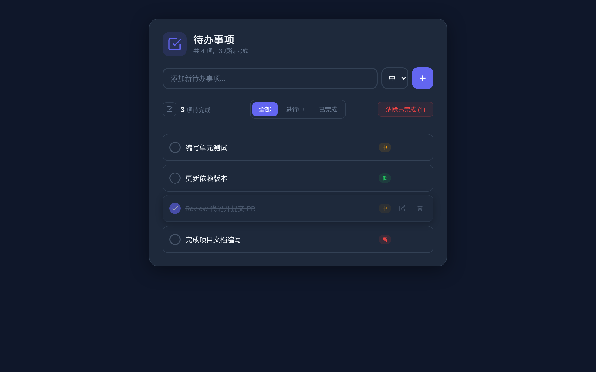

# Todo App

一个基于 Vue 3 + TypeScript 构建的现代待办事项应用。



## 技术栈

- **Vue 3** - Composition API + `<script setup>`
- **TypeScript** - 完整类型支持
- **Vite** - 极速构建工具
- **localStorage** - 数据本地持久化

## 功能特性

- 添加待办事项，支持设置优先级（低 / 中 / 高）
- 双击文本或点击编辑图标进行内容编辑
- 标记单项完成 / 一键全部完成
- 按状态筛选：全部 / 进行中 / 已完成
- 一键清除所有已完成项
- 数据自动持久化到 localStorage
- 跟随系统自动切换深色 / 浅色主题

## 快速开始

```bash
# 安装依赖
npm install

# 启动开发服务器
npm run dev

# 类型检查 + 构建
npm run build

# 预览构建产物
npm run preview
```

## 项目结构

```
src/
├── types/
│   └── index.ts              # Todo、Priority、FilterType 类型定义
├── composables/
│   └── useTodos.ts           # 核心业务逻辑（增删改查、筛选、持久化）
├── components/
│   ├── TodoInput.vue         # 输入框与优先级选择
│   ├── TodoItem.vue          # 单条待办（含编辑、删除）
│   └── TodoFilter.vue        # 筛选栏与统计信息
├── App.vue                   # 根组件
└── main.ts                   # 应用入口
```

## License

MIT
